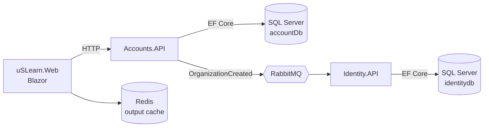

# uSLearn · Microservicios con .NET Aspire


Aplicación de referencia basada en **microservicios** con **.NET 10** y **.NET Aspire**, construida como laboratorio práctico para explorar patrones modernos de arquitectura distribuida: DDD, CQRS, eventos de dominio e integración, idempotencia y observabilidad.

> [!NOTE]
> **Basado en [dotnet/eShop](https://github.com/dotnet/eShop).**
> La arquitectura y buena parte de los building blocks (EventBus, EventBusRabbitMQ, IntegrationEventLogEF, SeedWork de dominio, `IdentifiedCommand`, `TransactionBehavior`, `ResilientTransaction`…) siguen los patrones de la aplicación de referencia oficial de Microsoft. Este repositorio los **reconstruye paso a paso** sobre un dominio propio, documentando el porqué de cada decisión y añadiendo variaciones (p. ej. idempotencia en los event handlers).

---

## 🧭 Overview

El proyecto evoluciona en **etapas incrementales**, cada una con su propia documentación en [`/docs`](docs). El dominio de ejemplo es una plataforma multi-tenant:

- **Accounts API** — gestiona organizaciones (aggregate `Organization`) y publica `OrganizationCreatedIntegrationEvent`.
- **Identity API** — consume ese evento y aprovisiona el tenant y su usuario administrador de forma idempotente.
- **Web** — frontend Blazor (por ahora la plantilla base de Aspire; se desarrollará en Stage.06).



El objetivo es servir como:

- 📚 guía educativa
- 🧪 sandbox técnico
- 🧱 base reutilizable para proyectos reales

---

## 🏗️ Stack tecnológico

| Área | Tecnologías |
| --- | --- |
| Runtime | .NET 10, ASP.NET Core Minimal APIs, API Versioning, OpenAPI |
| Orquestación | .NET Aspire 13.1 (AppHost, ServiceDefaults, service discovery, health checks, dashboard) |
| Dominio / aplicación | DDD (lightweight), CQRS con MediatR, pipeline behaviors (logging, validación, transacciones), FluentValidation |
| Persistencia | Entity Framework Core 10 + SQL Server, Redis |
| Mensajería | RabbitMQ, Outbox (Integration Event Log), consumidores idempotentes |
| Observabilidad | Logging estructurado, OpenTelemetry vía ServiceDefaults *(ampliación en Stage.04-3)* |
| Frontend *(planificado)* | Blazor Web App + Radzen |
| Seguridad *(planificado)* | Duende IdentityServer |

---

## 🎯 Objetivos arquitectónicos

- Separación clara entre bounded contexts
- Independencia y autonomía de servicios
- Comunicación desacoplada mediante eventos
- Observabilidad desde el inicio
- Evolución incremental, sin *big bang architecture*

---

## 🧩 Estructura de la solución

```
src/
 ├── uSLearn.AppHost/              → Orquestación .NET Aspire (SQL Server, RabbitMQ, Redis, servicios)
 ├── uSLearn.ServiceDefaults/      → Configuración compartida (OpenTelemetry, health checks, OpenAPI, resiliencia)
 │
 ├── uSLearn.Accounts.API/         → Microservicio de cuentas/organizaciones (DDD + CQRS)
 ├── uSLearn.Identity.API/         → Microservicio de identidad (consumidor de eventos)
 ├── uSLearn.Web/                  → Frontend Blazor
 │
 ├── Core.Domain/                  → SeedWork: Entity, ValueObject, IAggregateRoot, IUnitOfWork…
 ├── Core.Application/             → Behaviors de MediatR (Logging, Validation) y abstracciones
 ├── Core.Infrastructure/          → Utilidades transversales (migraciones, contexto HTTP, tracing)
 ├── Core.EventBus/                → Abstracciones del bus de eventos de integración
 ├── Core.EventBusRabbitMQ/        → Implementación del bus con RabbitMQ
 └── Core.IntegrationEventLogEF/   → Outbox, idempotencia de eventos y ResilientTransaction
docs/                              → Documentación detallada de cada etapa
```

---

## 🪜 Roadmap por etapas

| Stage | Descripción | Estado |
| --- | --- | --- |
| **Stage.01** | Creación del proyecto base | ✅ Completado |
| **Stage.02** | Eventos de dominio | ✅ Completado |
| **Stage.03** | **Eventos de integración + idempotencia** | ✅ Completado |
| ↳ Stage.03-1 | Eventos de integración con RabbitMQ | ✅ Completado |
| ↳ Stage.03-2 | Idempotencia y transaccionalidad (comandos) | ✅ Completado |
| ↳ Stage.03-3 | Idempotencia en event handlers | ✅ Completado |
| ↳ Stage.03-4 | Transacciones resilientes | ✅ Completado |
| **Stage.04** | **Observabilidad y validaciones** | 🚧 En progreso |
| ↳ Stage.04-1 | Logging enriquecido | ✅ Completado |
| ↳ Stage.04-2 | Validaciones con FluentValidation | ✅ Completado |
| ↳ Stage.04-3 | Telemetría con OpenTelemetry | 📋 Planificado |
| **Stage.05** | Identity con Duende IdentityServer | 📋 Planificado |
| **Stage.06** | Web App Blazor + Radzen | 📋 Planificado |
| **Stage.07** | Webhooks y extensibilidad | 📋 Planificado |

---

## 📖 Documentación

Cada etapa está documentada en [`/docs`](docs) con: objetivo, decisiones arquitectónicas, estructura añadida, código relevante y consideraciones futuras.

| Documento | Contenido |
| --- | --- |
| [Stage.01 – Project creation](docs/Stage.01-project%20creation.md) | Setup inicial con .NET Aspire |
| [Stage.02 – Domain events](docs/Stage.02-domain%20events.md) | Eventos de dominio con MediatR |
| [Stage.03-1 – Eventos de integración](docs/Stage.03-1-Eventos%20de%20Integracion.md) | Eventos de integración con RabbitMQ |
| [Stage.03-2 – Idempotencia](docs/Stage.03-2-Idempotencia.md) | Idempotencia en comandos |
| [Stage.03-3 – Idempotency handler](docs/Stage.03-3-Idempotency-Handler.md) | Idempotencia en event handlers |
| [Stage.03-4 – Transacciones resilientes](docs/Stage.03-4-Transacciones-Resilientes.md) | Atomicidad y reintentos en handlers de integración |
| [Stage.03 – Patrones arquitectónicos](docs/Stage.03-Patrones-Arquitectonicos.md) | Guía detallada de los patrones aplicados |
| [Stage.03 – Resumen](docs/RESUMEN-Stage.03.md) | Resumen de la etapa 3 |
| [Stage.04-1 – Logging](docs/Stage.04-1-Logging.md) | Logging estructurado y enriquecido |
| [Stage.04-2 – Validations](docs/Stage.04-2-Validations.md) | FluentValidation y manejo de excepciones |

---

## 🚀 Cómo ejecutar el proyecto

### Requisitos

- [.NET SDK 10](https://dotnet.microsoft.com/download)
- [Docker Desktop](https://www.docker.com/products/docker-desktop/) (o Podman) — **necesario**: Aspire levanta SQL Server, RabbitMQ y Redis como contenedores
- IDE: Visual Studio 2022+, Rider o VS Code con C# Dev Kit

### Ejecutar con Aspire

```bash
git clone https://github.com/miquelalcaraz/labs-Aspire.uSLearn.git
cd labs-Aspire.uSLearn
dotnet run --project src/uSLearn.AppHost
```

El AppHost arranca:

- Contenedores de **SQL Server**, **RabbitMQ** y **Redis**
- Los servicios `Accounts.API`, `Identity.API` y `Web` (las migraciones de EF Core se aplican al iniciar)
- El **dashboard de Aspire** (la URL aparece en la consola) con logs, trazas y métricas

Para probar la API puedes usar el fichero [`Aspire.uSLearn.ApiService.http`](src/uSLearn.Accounts.API/Aspire.uSLearn.ApiService.http).

---

## 🧠 Conceptos clave

- Domain Events vs Integration Events
- Consistencia eventual y patrón Outbox
- Procesamiento idempotente (comandos y consumidores)
- CQRS con MediatR y pipeline behaviors
- Integración basada en contratos (eventos)
- Aislamiento de bounded contexts

---

## ⚠️ Estado del proyecto

Proyecto en construcción incremental. No pretende ser una arquitectura definitiva, sino una **referencia evolutiva** que muestra trade-offs reales. La configuración (credenciales de contenedores, etc.) está pensada exclusivamente para desarrollo local.

---

## 🙏 Créditos

- [dotnet/eShop](https://github.com/dotnet/eShop) — aplicación de referencia de Microsoft en la que se basa la arquitectura y varios componentes de este proyecto (licencia MIT).
- [.NET Aspire](https://learn.microsoft.com/dotnet/aspire/)

## 🤝 Contribuciones

Repositorio pensado como referencia personal y educativa; cualquier sugerencia o mejora es bienvenida vía *issues* o *pull requests*.

## 👤 Autor

**Miquel Alcaraz** — [GitHub](https://github.com/miquelalcaraz)
