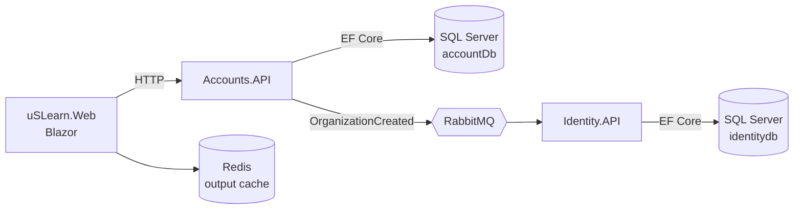
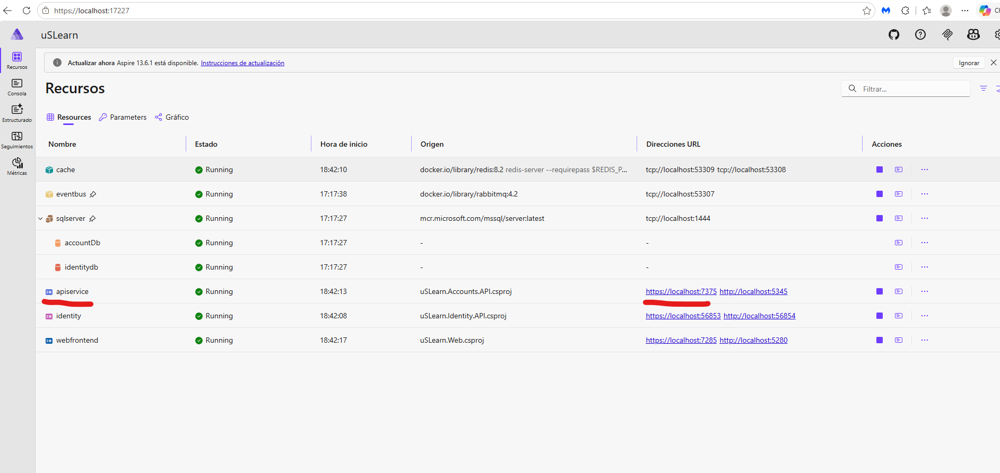
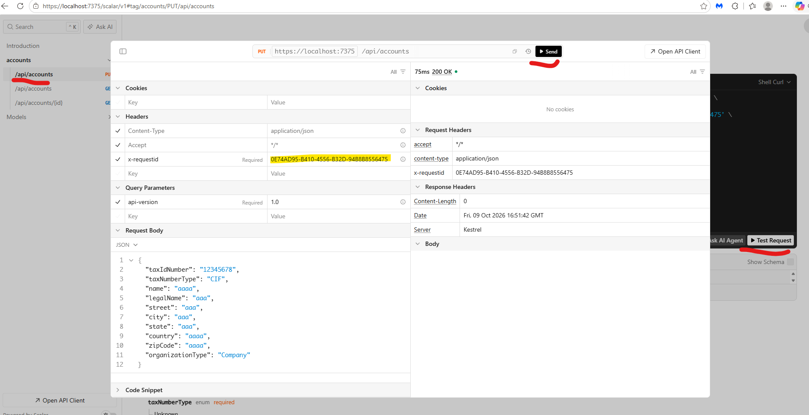
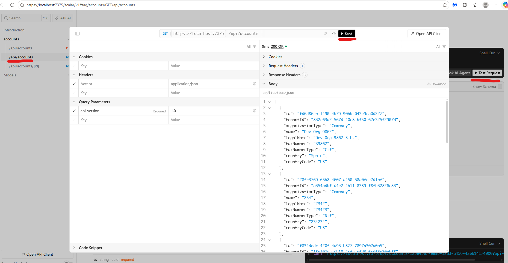
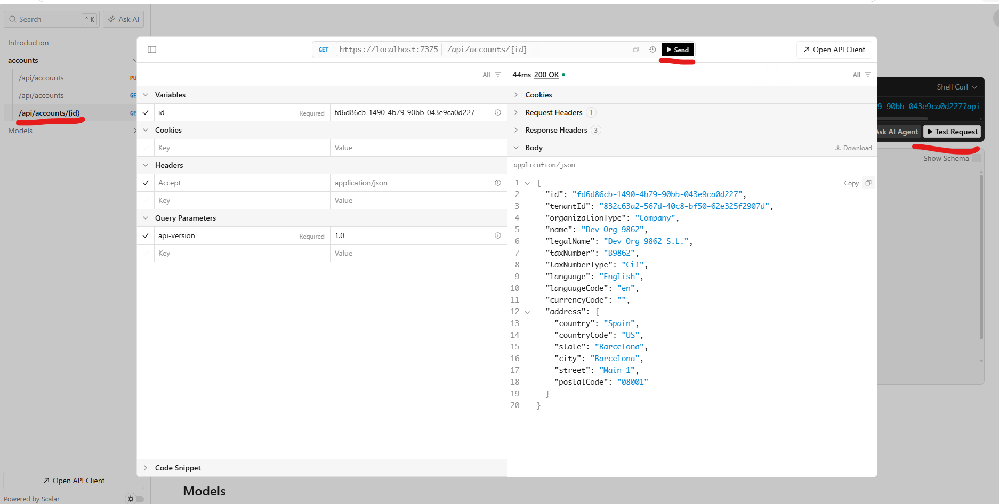

# uSLearn · Microservices with .NET Aspire


[](LICENSE)

A **microservices** reference application built with **.NET 10** and **.NET Aspire**, used as a hands-on lab to explore modern distributed architecture patterns: DDD, CQRS, domain and integration events, idempotency and observability.

Rather than presenting a finished product, this repository demonstrates **how a distributed architecture evolves through explicit design decisions**. Each stage introduces a concrete problem, an implementation, and documented trade-offs. You can explore the latest implementation on `main` or follow its evolution through the `stages/*` branches.

**Start here:** [Architecture overview](#-overview) · [Key design decisions](#-key-design-decisions) · [Stage-by-stage documentation](#-documentation) · [Run locally](#-running-the-project)

> [!NOTE]
> **Based on [dotnet/eShop](https://github.com/dotnet/eShop).**
> The architecture and many of the building blocks (EventBus, EventBusRabbitMQ, IntegrationEventLogEF, domain SeedWork, `IdentifiedCommand`, `TransactionBehavior`, `ResilientTransaction`…) follow the patterns of Microsoft's official reference application. This repository **rebuilds them step by step** on its own domain, documenting the reasoning behind each decision and adding variations (e.g. idempotent event handlers, resilient transactions in integration handlers).

---

## 🧭 Overview

The project evolves in **incremental stages**, each with its own documentation in [`/docs`](docs). The sample domain is a multi-tenant platform:

- **Accounts API** — manages organizations (`Organization` aggregate) and publishes `OrganizationCreatedIntegrationEvent`.
- **Identity API** — consumes that event and provisions the tenant and its admin user, idempotently and in a single resilient transaction.
- **Web** — Blazor frontend (currently the Aspire starter template; it will be built out in Stage.06).



It is meant to be:

- 📚 a learning guide
- 🧪 a technical sandbox
- 🧱 a reusable foundation for real projects

---

## 🏗️ Tech Stack

| Area | Technologies |
| --- | --- |
| Runtime | .NET 10, ASP.NET Core minimal APIs, API versioning, OpenAPI + Scalar |
| Orchestration | .NET Aspire 13.1 (AppHost, ServiceDefaults, service discovery, health checks, dashboard) |
| Domain / application | DDD (lightweight), CQRS with MediatR, pipeline behaviors (logging, validation, transactions), FluentValidation |
| Persistence | Entity Framework Core 10 + SQL Server (with retry on transient failures), Redis |
| Messaging | RabbitMQ, outbox (integration event log), idempotent consumers |
| Observability | Structured logging, OpenTelemetry (custom traces and metrics, trace context propagated through RabbitMQ) |
| Frontend *(planned)* | Blazor Web App + Radzen |
| Security *(planned)* | Duende IdentityServer |

---

## 🎯 Architectural Goals

- Clear separation between bounded contexts
- Independent, autonomous services
- Decoupled communication through events
- Observability from day one
- Incremental evolution, no *big bang architecture*

---

## 🔎 Key Design Decisions

The documentation explains not only *what* was implemented, but also *why*, including constraints and remaining limitations.

| Decision | Rationale and implementation |
| --- | --- |
| Separate Accounts and Identity services | [Overview](#-overview) — independent responsibilities connected through integration events |
| Domain events vs. integration events | [Stage.02](docs/Stage.02-Domain-Events.md) and [Stage.03-1](docs/Stage.03-1-Integration-Events.md) |
| Transactional outbox and eventual consistency | [Architectural patterns](docs/Stage.03-Architectural-Patterns.md) — includes delivery limitations |
| Command and consumer idempotency | [Stage.03-2](docs/Stage.03-2-Idempotency.md) and [Stage.03-3](docs/Stage.03-3-Idempotency-Handler.md) |
| Resilient database transactions | [Stage.03-4](docs/Stage.03-4-Resilient-Transactions.md) |
| Centralized, vendor-neutral telemetry | [Stage.04-3](docs/Stage.04-3-Telemetry.md) — OpenTelemetry and trace propagation through RabbitMQ |

These are **learning-stage design choices**, not claims of production readiness. See [Project Status](#️-project-status) for scope and limitations.

---

## 🧩 Solution Structure

```
src/
 ├── uSLearn.AppHost/              → .NET Aspire orchestration (SQL Server, RabbitMQ, Redis, services)
 ├── uSLearn.ServiceDefaults/      → Shared configuration (OpenTelemetry, health checks, OpenAPI, resilience)
 │
 ├── uSLearn.Accounts.API/         → Accounts/organizations microservice (DDD + CQRS)
 ├── uSLearn.Identity.API/         → Identity microservice (event consumer)
 ├── uSLearn.Web/                  → Blazor frontend
 │
 ├── Core.Domain/                  → SeedWork: Entity, ValueObject, IAggregateRoot, IUnitOfWork…
 ├── Core.Application/             → MediatR behaviors (logging, validation), telemetry and abstractions
 ├── Core.Infrastructure/          → Cross-cutting utilities (migrations, HTTP context, tracing)
 ├── Core.EventBus/                → Integration event bus abstractions
 ├── Core.EventBusRabbitMQ/        → RabbitMQ implementation of the bus
 └── Core.IntegrationEventLogEF/   → Outbox, event idempotency and ResilientTransaction
docs/                              → Detailed documentation for each stage
```

---

## 🪜 Roadmap

| Stage | Description | Status |
| --- | --- | --- |
| **Stage.01** | Base project creation | ✅ Done |
| **Stage.02** | Domain events | ✅ Done |
| **Stage.03** | **Integration events + idempotency** | ✅ Done |
| ↳ Stage.03-1 | Integration events with RabbitMQ | ✅ Done |
| ↳ Stage.03-2 | Idempotency and transactionality (commands) | ✅ Done |
| ↳ Stage.03-3 | Idempotent event handlers | ✅ Done |
| ↳ Stage.03-4 | Resilient transactions | ✅ Done |
| **Stage.04** | **Observability and validation** | ✅ Done |
| ↳ Stage.04-1 | Enriched logging | ✅ Done |
| ↳ Stage.04-2 | Validation with FluentValidation | ✅ Done |
| ↳ Stage.04-3 | Telemetry with OpenTelemetry | ✅ Done |
| **Stage.05** | Identity with Duende IdentityServer | 📋 Planned |
| **Stage.06** | Blazor web app + Radzen | 📋 Planned |
| **Stage.07** | Webhooks and extensibility | 📋 Planned |

---

## 📖 Documentation

Each stage is documented in [`/docs`](docs): goal, architectural decisions, added structure, relevant code and future considerations.

The code for each stage lives in its own branch (`stages/stage-01`, `stages/stage-02`, …, `stages/stage-04.3`), and every branch includes all the previous ones. The documentation is kept up to date in `main`.

| Document | Content |
| --- | --- |
| [Stage.01 – Project creation](docs/Stage.01-Project-Creation.md) | Initial setup with .NET Aspire |
| [Stage.02 – Domain events](docs/Stage.02-Domain-Events.md) | Domain events with MediatR |
| [Stage.03-1 – Integration events](docs/Stage.03-1-Integration-Events.md) | Integration events with RabbitMQ |
| [Stage.03-2 – Idempotency](docs/Stage.03-2-Idempotency.md) | Command idempotency and the outbox |
| [Stage.03-3 – Idempotent event handlers](docs/Stage.03-3-Idempotency-Handler.md) | Idempotency in event handlers |
| [Stage.03-4 – Resilient transactions](docs/Stage.03-4-Resilient-Transactions.md) | Atomicity and retries in integration handlers |
| [Stage.03 – Architectural patterns](docs/Stage.03-Architectural-Patterns.md) | In-depth guide to the patterns applied |
| [Stage.04-1 – Logging](docs/Stage.04-1-Logging.md) | Structured, enriched logging |
| [Stage.04-2 – Validation](docs/Stage.04-2-Validations.md) | FluentValidation and exception handling |
| [Stage.04-3 – Telemetry](docs/Stage.04-3-Telemetry.md) | Traces, metrics and context propagation with OpenTelemetry |

---

## 🚀 Running the Project

### Requirements

- [.NET 10 SDK](https://dotnet.microsoft.com/download)
- [Docker Desktop](https://www.docker.com/products/docker-desktop/) (or Podman) — **required**: Aspire runs SQL Server, RabbitMQ and Redis as containers
- IDE: Visual Studio 2022+, Rider or VS Code with C# Dev Kit

### Run with Aspire

```bash
git clone https://github.com/miquelalcaraz/Labs.Aspire.uSLearn.git
cd Labs.Aspire.uSLearn
dotnet run --project src/uSLearn.AppHost
```

The AppHost starts:

- **SQL Server**, **RabbitMQ** and **Redis** containers
- The `Accounts.API`, `Identity.API` and `Web` services (EF Core migrations are applied at startup)
- The **Aspire dashboard** (its URL is printed in the console) with logs, traces and metrics

### Try it out

**1. Open the Aspire dashboard** and check that every resource is running. Click the `apiservice` URL to open the Accounts API.



**2. Create an organization** from the Scalar API reference (`/scalar/v1`): `PUT /api/accounts` with an `x-requestid` header. Sending the same request again with the same `x-requestid` doesn't create a duplicate.



**3. List the organizations** with `GET /api/accounts`…



**4. …or get one by id** with `GET /api/accounts/{id}`.



Creating an organization publishes `OrganizationCreatedIntegrationEvent`; `Identity.API` consumes it and creates the tenant and its admin user. In the dashboard's **Traces** view, the whole flow appears as a single trace, from the HTTP request to the consumer in `identity`.

The same requests are available in [`Aspire.uSLearn.ApiService.http`](src/uSLearn.Accounts.API/Aspire.uSLearn.ApiService.http) for Visual Studio / VS Code / Rider.

---

## 🧠 Key Concepts

- Domain events vs integration events
- Eventual consistency and the outbox pattern
- Idempotent processing (commands and consumers)
- Resilient transactions with EF Core execution strategies
- CQRS with MediatR and pipeline behaviors
- Contract-based integration (events)
- Bounded context isolation

---

## ⚠️ Project Status

The project is under incremental construction. It isn't meant to be a final architecture but an **evolving reference** that shows real trade-offs. The configuration (container credentials, etc.) is intended for local development only.

---

## 🙏 Credits

- [dotnet/eShop](https://github.com/dotnet/eShop) — Microsoft's reference application on which this project's architecture and several components are based (MIT license).
- [.NET Aspire](https://learn.microsoft.com/dotnet/aspire/)

## 📄 License

Distributed under the [MIT](LICENSE) license. The parts derived from [dotnet/eShop](https://github.com/dotnet/eShop) keep the copyright of the .NET Foundation and Contributors, also under MIT.

## 🤝 Contributing

This repository is a personal, educational reference, but suggestions and improvements are welcome through issues or pull requests.

## 👤 Author

**Miquel Alcaraz** — [GitHub](https://github.com/miquelalcaraz)
