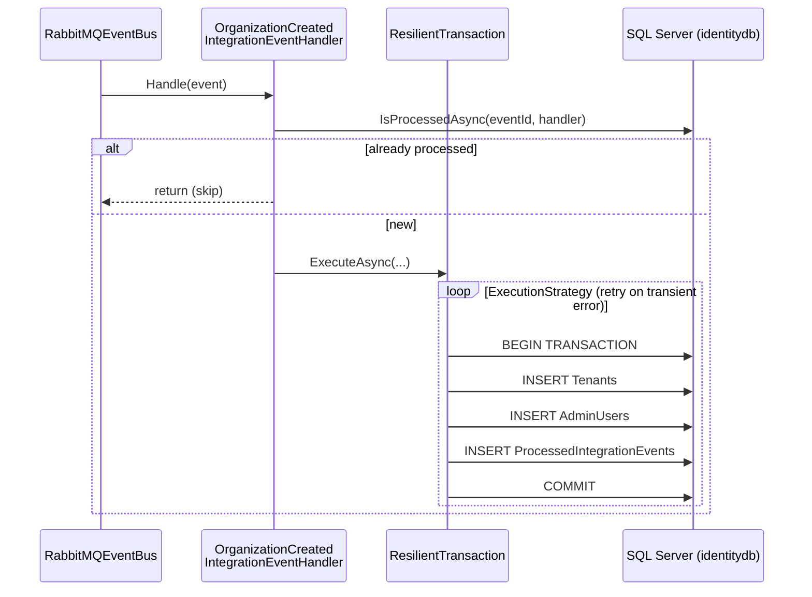

# Stage.03-4 - Resilient Transactions

> [!NOTE]
> **Historical stage context.** This document describes the transaction changes introduced in Stage.03-4. Its Accounts retry limitation refers to that stage: the current `TransactionBehavior` clears tracked state on retries and publishes integration events outside the execution strategy. See the [current source](../src/uSLearn.Accounts.API/Application/Behaviors/TransactionBehavior.cs) and [README](../README.md#️-project-status) for the latest implementation and remaining delivery limitations.

## 🎯 Goal

Make integration event processing in `Identity.API` **atomic and resilient**: creating the tenant, creating the admin user and recording idempotency must be committed together or not at all, and transient SQL Server failures (deadlocks, timeouts) must be retried automatically.

---

## 🏗️ Architectural Decisions

### Commands vs integration events

In `Accounts.API`, commands have been atomic since Stage.03-2: MediatR's `TransactionBehavior` wraps every command in a transaction.

**Integration event handlers don't go through MediatR**: the `RabbitMQEventBus` invokes them directly. Each handler therefore has to manage its own transaction. That was the missing piece.

### The problem in Stage.03-3

```csharp
// Stage.03-3: three independent operations
var tenant = await CreateTenantAsync(@event);              // in-memory repository
var adminUser = await CreateAdminUserAsync(@event, ...);   // in-memory repository
await _idempotencyService.MarkAsProcessedAsync(...);       // SaveChanges() on SQL Server
```

- **Volatile persistence**: tenant and user lived in in-memory (singleton) repositories and were lost on restart.
- **No atomicity**: if `MarkAsProcessedAsync` failed, the tenant was already created and the event stayed "unprocessed".
- **No retries**: a deadlock or timeout made the handler fail straight away.

### The solution

1. **EF Core repositories** (`TenantRepository`, `UserRepository`) on the same `IdentityContext` used by the idempotency service.
2. **`ResilientTransaction`** (building block in `Core.IntegrationEventLogEF`, same pattern as [eShop](https://github.com/dotnet/eShop)): runs the logic inside an EF Core *execution strategy* and an explicit transaction.
3. **`EnableRetryOnFailure`** on the `DbContext`: without a retrying strategy, `CreateExecutionStrategy()` returns one that **never retries**.



---

## 📦 Implemented Components

### 1. `ResilientTransaction`

`src/Core.IntegrationEventLogEF/Utilities/ResilientTransaction.cs`

```csharp
public async Task<T> ExecuteAsync<T>(Func<Task<T>> action)
{
    var strategy = _context.Database.CreateExecutionStrategy();
    var attempt = 0;

    return await strategy.ExecuteAsync(async () =>
    {
        // Entities tracked by a failed attempt would collide with the ones the retry adds again
        if (attempt++ > 0)
        {
            _context.ChangeTracker.Clear();
        }

        await using var transaction = await _context.Database.BeginTransactionAsync();
        try
        {
            var result = await action();
            await transaction.CommitAsync();
            return result;
        }
        catch
        {
            await transaction.RollbackAsync();
            throw;
        }
    });
}
```

- The transaction is opened **inside** `strategy.ExecuteAsync`: with a retrying strategy, EF Core doesn't allow explicit transactions outside it.
- Each retry runs the **whole** action again. That's why the `ChangeTracker` is cleared: the `Tenant` from the failed attempt (same `Id`) would still be tracked and EF would throw a duplicate-entity error.
- Overloads: `ExecuteAsync(Func<Task>)` and `ExecuteAsync(action, onCommitted)`, whose callback only runs after a successful commit and **outside** the strategy (it isn't repeated on retries).

### 2. Retry strategy in Identity.API

`src/uSLearn.Identity.API/Extensions/Extensions.cs`

```csharp
options.UseSqlServer(connectionString, sqlOptions =>
{
    sqlOptions.MigrationsAssembly(typeof(Program).Assembly.FullName);
    // Retry transient SQL errors (deadlocks, timeouts); required by ResilientTransaction
    sqlOptions.EnableRetryOnFailure(maxRetryCount: 5, maxRetryDelay: TimeSpan.FromSeconds(10), errorNumbersToAdd: null);
});
```

### 3. Persistence with EF Core

- `IdentityContext` adds `Tenants` and `AdminUsers` (`identity` schema), with unique indexes on `OrganizationId` and on `(TenantId, Email)`.
- `TenantRepository` and `UserRepository` replace the in-memory repositories, which are removed.
- The repositories change from **Singleton** to **Scoped**, the same lifetime as the `DbContext`, so they share the context and the transaction.
- Migration: `AddTenantsAndAdminUsers`. It is applied automatically at startup (`AddMigration<IdentityContext, IdentityContextSeed>()`).

### 4. Handler

`src/uSLearn.Identity.API/IntegrationEvents/EventHandling/OrganizationCreatedIntegrationEventHandler.cs`

```csharp
// Check if event already processed (outside transaction to avoid unnecessary locks)
if (await _idempotencyService.IsProcessedAsync(@event.Id, handlerName))
{
    return;
}

await ResilientTransaction.New(_context).ExecuteAsync(async () =>
{
    var tenant = await CreateTenantAsync(@event);
    var adminUser = await CreateAdminUserAsync(@event, tenant.Id);

    // Mark as processed (within the same transaction)
    await _idempotencyService.MarkAsProcessedAsync(@event.Id, handlerName, @event.GetType().Name);
});
```

Each repository and the idempotency service call `SaveChangesAsync()`, but because they share the `IdentityContext`, every write stays inside the same transaction and is confirmed by the final `COMMIT`.

The idempotency check runs **outside** the transaction so duplicates don't lock resources. If two deliveries of the same event arrive at the same time, the `(EventId, HandlerName)` primary key of `ProcessedIntegrationEvents` makes the second one fail, and its whole transaction is rolled back.

---

## 🔄 Step-by-Step Flow

1. `Accounts.API` creates the organization and publishes `OrganizationCreatedIntegrationEvent` (outbox, Stage.03-2).
2. `Identity.API` receives the event; `IsProcessedAsync` → `false`.
3. `ResilientTransaction` opens the execution strategy and the transaction.
4. `Tenant`, `AdminUser` and the `ProcessedIntegrationEvents` row are inserted.
5. `COMMIT`: the three rows are persisted together.
6. **Transient error** at any step → rollback, and the strategy repeats steps 3–5.
7. **Non-transient error** (e.g. unique index violation) → rollback, and the exception leaves the handler.

---

## ✅ Practical Verification

1. Start the solution:

   ```bash
   dotnet run --project src/uSLearn.AppHost
   ```

2. Create an organization (the `x-requestid` header is required):

   ```http
   PUT https://localhost:7375/api/accounts?api-version=1.0
   x-requestid: 3f1c2a9e-5b7d-4c11-9a0e-2d6f8b4e1c77
   Content-Type: application/json

   {
     "taxIdNumber": "B12345678",
     "taxNumberType": "Cif",
     "name": "ACME Corp",
     "legalName": "ACME Corporation S.L.",
     "street": "Main Street 1",
     "city": "Barcelona",
     "state": "Barcelona",
     "country": "Spain",
     "zipCode": "08001",
     "organizationType": "Company"
   }
   ```

3. Check `identitydb`:

   ```sql
   SELECT * FROM [identity].Tenants WHERE Name = 'ACME Corp';
   SELECT * FROM [identity].AdminUsers WHERE Email = 'admin@acmecorp.com';
   SELECT * FROM [identity].ProcessedIntegrationEvents;
   ```

4. **Rollback**: temporarily throw an exception in `CreateAdminUserAsync` and repeat step 2 with a different `x-requestid` and name. Neither the `Tenant` nor the `ProcessedIntegrationEvents` row should be left behind.

---

## ⚠️ Known Limitations

- **No redelivery of failed events**: like eShop, the `RabbitMQEventBus` acks the message even when the handler fails. A non-transient error means the event is lost; in production this would be solved with a *dead letter exchange*.
- **Accounts.API**: at this stage its `TransactionBehavior` doesn't retry yet, because it has no `EnableRetryOnFailure`. It is enabled later in `dev`, where the behavior is also adapted to retries (it resets the transaction and the `ChangeTracker`, and publishes outside the strategy).
- **Outbox without publish retry**: events left as `PublishedFailed` are not republished; a background process is still missing.

---

## 🧩 Next Steps

➡️ **Stage.04**: Observability and validation. Shared structured logging (04-1), validation with FluentValidation (04-2) and telemetry with OpenTelemetry (04-3).
