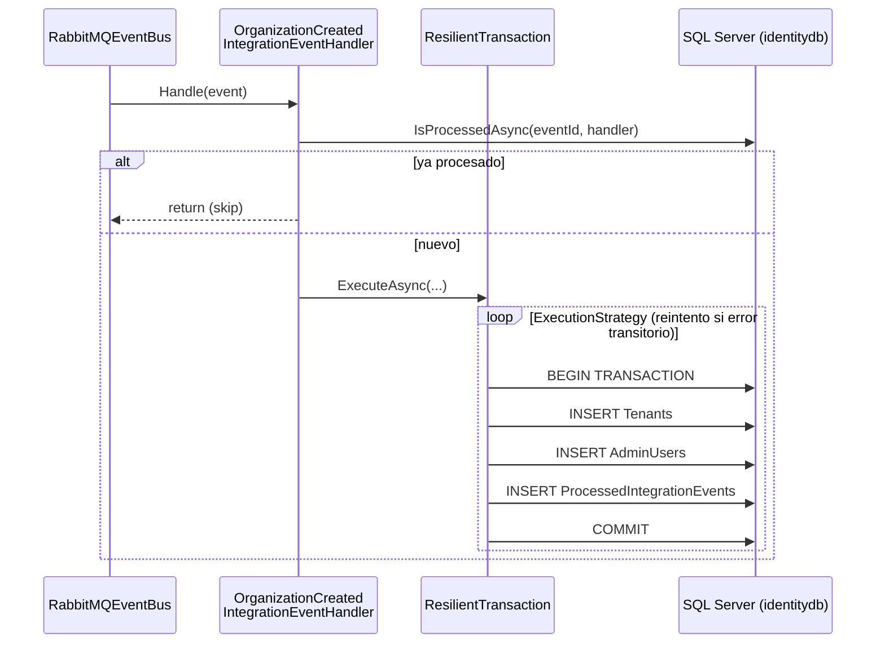

# Stage.03-4 - Transacciones Resilientes

## 🎯 Objetivo

Hacer **atómico y resiliente** el procesamiento de eventos de integración en `Identity.API`: la creación del tenant, la del usuario administrador y el registro de idempotencia deben confirmarse juntos o no confirmarse, y los fallos transitorios de SQL Server (deadlocks, timeouts) deben reintentarse automáticamente.

---

## 🏗️ Decisiones Arquitectónicas

### Comandos vs. eventos de integración

En `Accounts.API` los comandos ya son atómicos desde el Stage.03-2: el `TransactionBehavior` de MediatR envuelve cada comando en una transacción.

Los **handlers de eventos de integración no pasan por MediatR**: los invoca directamente el `RabbitMQEventBus`. Por tanto, cada handler debe gestionar su propia transacción. Esa es la pieza que faltaba.

### El problema en el Stage.03-3

```csharp
// Stage.03-3: tres operaciones independientes
var tenant = await CreateTenantAsync(@event);              // repositorio en memoria
var adminUser = await CreateAdminUserAsync(@event, ...);   // repositorio en memoria
await _idempotencyService.MarkAsProcessedAsync(...);       // SaveChanges() en SQL Server
```

- **Persistencia volátil**: tenant y usuario vivían en repositorios en memoria (singleton); se perdían al reiniciar.
- **Sin atomicidad**: si fallaba `MarkAsProcessedAsync`, el tenant ya estaba creado y el evento quedaba "sin procesar".
- **Sin reintentos**: un deadlock o timeout hacía fallar el handler directamente.

### La solución

1. **Repositorios EF Core** (`TenantRepository`, `UserRepository`) sobre el mismo `IdentityContext` que usa el servicio de idempotencia.
2. **`ResilientTransaction`** (building block en `Core.IntegrationEventLogEF`, mismo patrón que [eShop](https://github.com/dotnet/eShop)): ejecuta la lógica dentro de una *execution strategy* de EF Core y una transacción explícita.
3. **`EnableRetryOnFailure`** en el `DbContext`: sin una estrategia con reintentos, `CreateExecutionStrategy()` devuelve una estrategia que **no reintenta**.



---

## 📦 Componentes Implementados

### 1. `ResilientTransaction`

`src/Core.IntegrationEventLogEF/Utilities/ResilientTransaction.cs`

```csharp
public async Task<T> ExecuteAsync<T>(Func<Task<T>> action)
{
    var strategy = _context.Database.CreateExecutionStrategy();
    var attempt = 0;

    return await strategy.ExecuteAsync(async () =>
    {
        // Entities tracked by a failed attempt would collide with the ones the retry adds again
        if (attempt++ > 0)
        {
            _context.ChangeTracker.Clear();
        }

        await using var transaction = await _context.Database.BeginTransactionAsync();
        try
        {
            var result = await action();
            await transaction.CommitAsync();
            return result;
        }
        catch
        {
            await transaction.RollbackAsync();
            throw;
        }
    });
}
```

- La transacción se abre **dentro** de `strategy.ExecuteAsync`: con una estrategia de reintentos, EF Core no permite transacciones explícitas fuera de ella.
- En cada reintento se ejecuta **toda** la acción otra vez. Por eso se limpia el `ChangeTracker`: el `Tenant` del intento fallido (mismo `Id`) seguiría rastreado y EF lanzaría un error de entidad duplicada.
- Sobrecargas: `ExecuteAsync(Func<Task>)` y `ExecuteAsync(action, onCommitted)`, cuyo callback se ejecuta solo tras un commit correcto y **fuera** de la estrategia (no se repite en reintentos).

### 2. Retry strategy en Identity.API

`src/uSLearn.Identity.API/Extensions/Extensions.cs`

```csharp
options.UseSqlServer(connectionString, sqlOptions =>
{
    sqlOptions.MigrationsAssembly(typeof(Program).Assembly.FullName);
    // Retry transient SQL errors (deadlocks, timeouts); required by ResilientTransaction
    sqlOptions.EnableRetryOnFailure(maxRetryCount: 5, maxRetryDelay: TimeSpan.FromSeconds(10), errorNumbersToAdd: null);
});
```

### 3. Persistencia con EF Core

- `IdentityContext` añade `Tenants` y `AdminUsers` (esquema `identity`), con índice único por `OrganizationId` y por `(TenantId, Email)`.
- `TenantRepository` y `UserRepository` sustituyen a los repositorios en memoria, que se eliminan.
- Los repositorios pasan de **Singleton** a **Scoped**, el mismo ciclo de vida que el `DbContext`, para compartir contexto y transacción.
- Migración: `AddTenantsAndAdminUsers`. Se aplica automáticamente al arrancar (`AddMigration<IdentityContext, IdentityContextSeed>()`).

### 4. Handler

`src/uSLearn.Identity.API/IntegrationEvents/EventHandling/OrganizationCreatedIntegrationEventHandler.cs`

```csharp
// Check if event already processed (outside transaction to avoid unnecessary locks)
if (await _idempotencyService.IsProcessedAsync(@event.Id, handlerName))
{
    return;
}

await ResilientTransaction.New(_context).ExecuteAsync(async () =>
{
    var tenant = await CreateTenantAsync(@event);
    var adminUser = await CreateAdminUserAsync(@event, tenant.Id);

    // Mark as processed (within the same transaction)
    await _idempotencyService.MarkAsProcessedAsync(@event.Id, handlerName, @event.GetType().Name);
});
```

Cada repositorio y el servicio de idempotencia llaman a `SaveChangesAsync()`, pero al compartir el `IdentityContext` todas las escrituras quedan dentro de la misma transacción y se confirman en el `COMMIT` final.

La comprobación de idempotencia se hace **fuera** de la transacción para no bloquear recursos con duplicados. Si dos entregas del mismo evento llegan a la vez, la clave primaria `(EventId, HandlerName)` de `ProcessedIntegrationEvents` hace fallar la segunda, y su transacción se revierte entera.

---

## 🔄 Flujo Paso a Paso

1. `Accounts.API` crea la organización y publica `OrganizationCreatedIntegrationEvent` (outbox, Stage.03-2).
2. `Identity.API` recibe el evento; `IsProcessedAsync` → `false`.
3. `ResilientTransaction` abre la estrategia de ejecución y la transacción.
4. Se insertan `Tenant`, `AdminUser` y el registro en `ProcessedIntegrationEvents`.
5. `COMMIT`: las tres filas se persisten juntas.
6. **Error transitorio** en cualquier paso → rollback y la estrategia repite 3–5.
7. **Error no transitorio** (p. ej. violación de índice único) → rollback y la excepción sale del handler.

---

## ✅ Verificación Práctica

1. Arrancar la solución:

   ```bash
   dotnet run --project src/uSLearn.AppHost
   ```

2. Crear una organización (la cabecera `x-requestid` es obligatoria):

   ```http
   PUT https://localhost:7375/api/accounts?api-version=1.0
   x-requestid: 3f1c2a9e-5b7d-4c11-9a0e-2d6f8b4e1c77
   Content-Type: application/json

   {
     "taxIdNumber": "B12345678",
     "taxNumberType": "Cif",
     "name": "ACME Corp",
     "legalName": "ACME Corporation S.L.",
     "street": "Main Street 1",
     "city": "Barcelona",
     "state": "Barcelona",
     "country": "Spain",
     "zipCode": "08001",
     "organizationType": "Company"
   }
   ```

3. Comprobar en `identitydb`:

   ```sql
   SELECT * FROM [identity].Tenants WHERE Name = 'ACME Corp';
   SELECT * FROM [identity].AdminUsers WHERE Email = 'admin@acmecorp.com';
   SELECT * FROM [identity].ProcessedIntegrationEvents;
   ```

4. **Rollback**: lanzar temporalmente una excepción en `CreateAdminUserAsync` y repetir el paso 2 con otro `x-requestid` y otro nombre. No debe quedar ni el `Tenant` ni el registro en `ProcessedIntegrationEvents`.

---

## ⚠️ Limitaciones Conocidas

- **Sin reentrega de eventos fallidos**: el `RabbitMQEventBus`, igual que en eShop, hace `ack` del mensaje aunque el handler falle. Un error no transitorio hace que el evento se pierda; en producción se resolvería con una *Dead Letter Exchange*.
- **Accounts.API**: en esta etapa su `TransactionBehavior` todavía no reintenta, porque no tiene `EnableRetryOnFailure`. Se activa más adelante en `dev`, donde el behavior también se adapta a los reintentos (reinicia la transacción y el `ChangeTracker`, y publica fuera de la estrategia).
- **Outbox sin reintento de publicación**: los eventos que quedan en `PublishedFailed` no se republican; falta un proceso en segundo plano.

---

## 🧩 Próximos Pasos

➡️ **Stage.04**: Observabilidad y validaciones. Logging estructurado compartido (04-1), validaciones con FluentValidation (04-2) y telemetría con OpenTelemetry (04-3).
